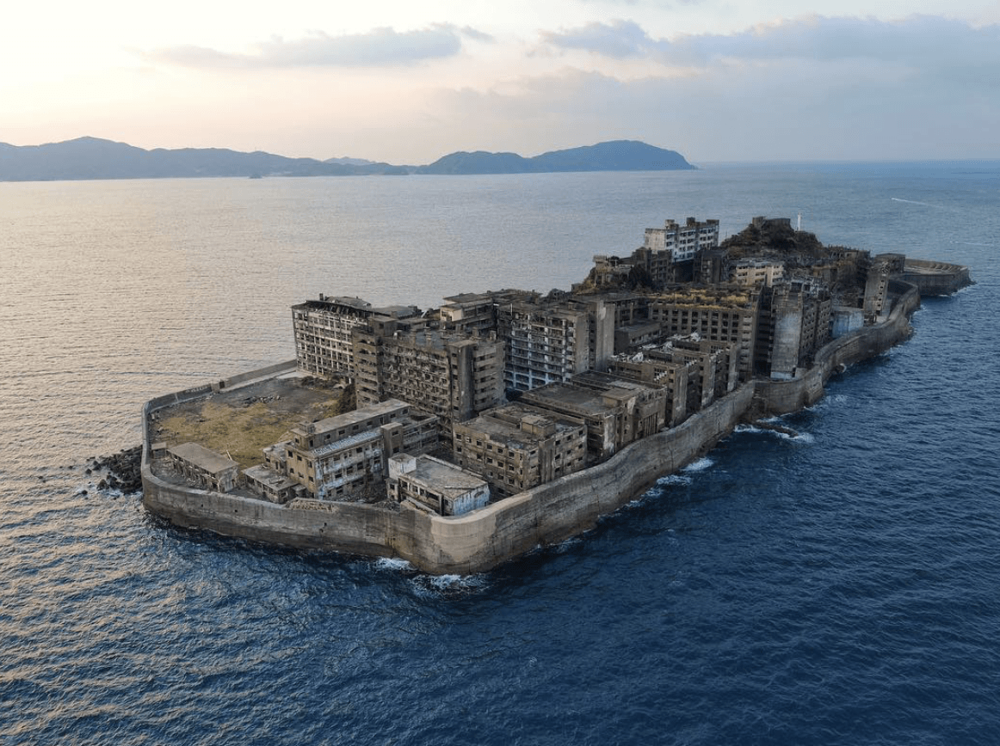
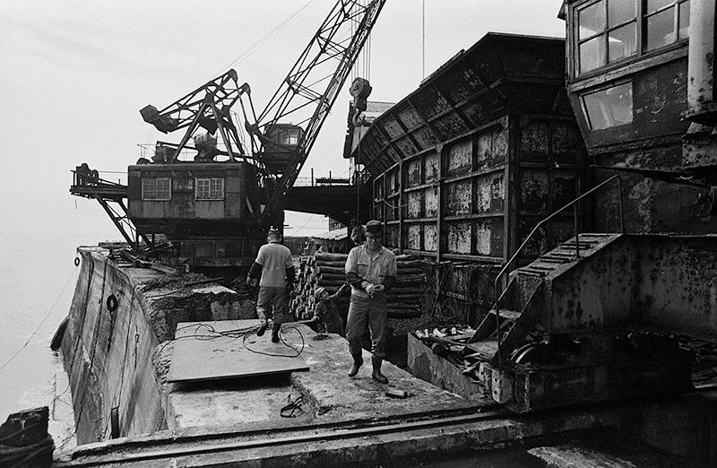
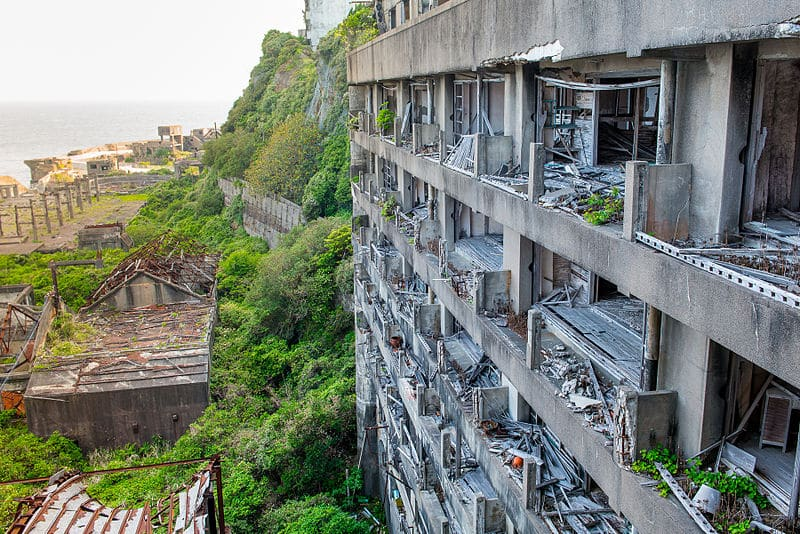
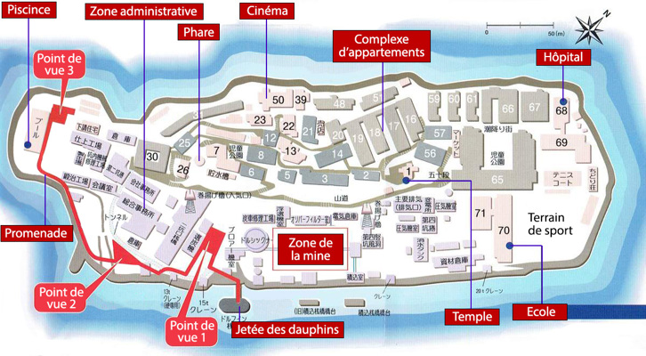
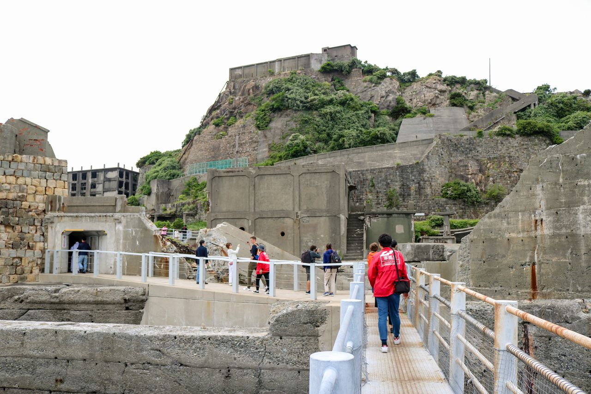
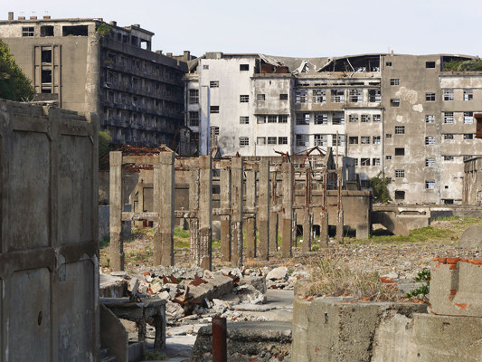
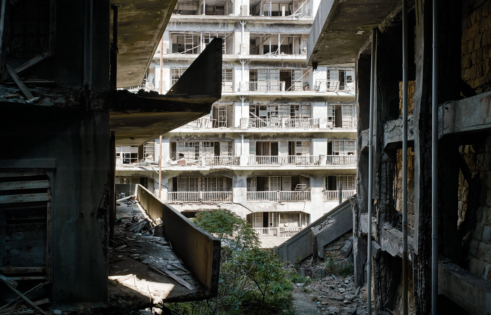

# gunkan-jima-site-site
Ha-shima, aussi appelée Gunkan-jima (« l’île cuirassée »).
<!DOCTYPE html><title>L'Île abandonnée Gunkan-Jima</title>
<link rel="stylesheet" href="style.css">

<html lang="fr">
<head>
  <meta charset="UTF-8">
  <meta name="viewport" content="width=device-width, initial-scale=1.0">
  

  <header>   
    
Ha-shima (端島), aussi appelée Gunkan-jima

    
    

      <a href="carte.html">carte interactif</a>
      <a href="https://www.viator.com/fr-FR/tours/Nagasaki/Visit-Gunkanjima-island-the-Battleship-island-in-Nagasaki/d4665-13441P211" target="_blank" rel="noopener noreferrer">Réservez votre billet</a>
    

  </header>

<main>

<link rel="stylesheet" href="style.css" />
 
 
<h3> Gunkan-jima (« l’île cuirassée »), est une petite île du Japon.
       Elle se situe dans la préfecture de Nagasaki, à moins de 20 km au sud-ouest de la ville de Nagasaki.</h2>
 
<article>
        <h3>Ha-shima, l’île figée dans le temps</h3>
        
À quelques kilomètres de Nagasaki, une silhouette sombre se dessine à l’horizon.
           Entourée par la mer et battue par les vents, Ha-shima, aussi appelée Gunkan-jima, semble tout droit sortie d’un autre monde. Vue de loin, elle ressemble à un navire de guerre immobile, abandonné au large du Japon.
           Autrefois, cette petite île était pourtant pleine de vie. Grâce à l’exploitation du charbon, elle est devenue une ville dense et animée, où vivaient des milliers d’ouvriers et leurs familles. Immeubles, écoles, commerces et hôpital se dressaient sur seulement quelques hectares, faisant de Ha-shima l’un des endroits les plus peuplés de la planète.
           Mais lorsque le charbon a perdu son importance, la vie s’est peu à peu retirée. En 1974, les derniers habitants quittent l’île, laissant derrière eux bâtiments vides et rues silencieuses. Depuis, la mer et les typhons rongent lentement ce décor figé, transformant Ha-shima en une fascinante ville fantôme.
           Aujourd’hui classée au patrimoine mondial de l’UNESCO, l’île attire curieux, historiens et cinéastes. Entre mémoire industrielle, beauté inquiétante et pages sombres de l’Histoire, Ha-shima continue de captiver ceux qui posent leur regard sur elle.

           
</article>
 
<article>
        <h3>Ha-shima : symbole de l’industrialisation japonaise</h3>
        
Ha-shima, presque entièrement dédiée à l’exploitation du charbon, a été achetée par le groupe Mitsubishi en 1890 et devient rapidement un site minier stratégique pour l’industrialisation du Japon. La mine fonctionne jour et nuit et l’île se transforme en une véritable ville-usine.
           Pour loger la main-d’œuvre, des immeubles en béton armé sont construits dès le début du XXᵉ siècle. Ha-shima devient l’un des premiers lieux au Japon à utiliser massivement ce type de construction. Sur seulement 6,3 hectares, on trouve des logements, des écoles, des commerces, un hôpital et des équipements collectifs. À la fin des années 1950, la densité de population y atteint des records mondiaux.
           Cette prospérité repose cependant sur des conditions de travail extrêmement dures. Pendant la Seconde Guerre mondiale, environ 800 travailleurs coréens sont envoyés de force sur l’île. Soumis à un travail pénible et dangereux dans les mines souterraines, beaucoup meurent d’épuisement, de maladies ou d’accidents. Les tentatives de fuite sont sévèrement réprimées. Ces faits constituent aujourd’hui l’un des aspects les plus controversés de l’histoire de Ha-shima.
           Après la guerre, l’île continue à fonctionner à plein régime jusqu’au changement de politique énergétique du Japon. Le charbon est progressivement remplacé par le pétrole, rendant la mine non rentable. En 1974, Mitsubishi ferme définitivement le site. Les habitants sont évacués en quelques semaines, laissant derrière eux une ville intacte mais vide.
           Abandonnée depuis près de cinquante ans, Ha-shima est aujourd’hui un symbole fort : celui d’une industrialisation rapide, de ses réussites techniques, mais aussi de ses coûts humains et sociaux.

            
		   
		   
</article>
 
<table border="1">
  <tr>
    <th>Élément</th>
    <th>Donnée chiffrée</th>
    <th>Contexte / précision</th>
  </tr>

  <tr>
    <td>Distance de Nagasaki</td>
    <td>&lt; 20 km</td>
    <td>Au sud-ouest de la ville</td>
  </tr>

  <tr>
    <td>Découverte du charbon</td>
    <td>1810</td>
    <td>Île inhabitée à l’époque</td>
  </tr>

  <tr>
    <td>Achat par Mitsubishi</td>
    <td>1890</td>
    <td>Début de l’exploitation industrielle</td>
  </tr>

  <tr>
    <td>Agrandissements de l’île</td>
    <td>1899 – 1931</td>
    <td>Extensions artificielles</td>
  </tr>

  <tr>
    <td>Longueur de l’île</td>
    <td>480 m</td>
    <td>Dimension actuelle</td>
  </tr>

  <tr>
    <td>Largeur de l’île</td>
    <td>160 m</td>
    <td>Dimension actuelle</td>
  </tr>

  <tr>
    <td>Superficie</td>
    <td>6,3 hectares</td>
    <td>0,063 km²</td>
  </tr>

  <tr>
    <td>Population (1950)</td>
    <td>5 300 habitants</td>
    <td>Après-guerre</td>
  </tr>

  <tr>
    <td>Densité (1950)</td>
    <td>83 500 hab/km²</td>
    <td>Ensemble de l’île</td>
  </tr>

  <tr>
    <td>Densité maximale (1959)</td>
    <td>84 100 hab/km²</td>
    <td>Densité globale</td>
  </tr>

  <tr>
    <td>Densité quartier d’habitation</td>
    <td>139 100 hab/km²</td>
    <td>Record mondial</td>
  </tr>

  <tr>
    <td>Travailleurs coréens forcés</td>
    <td>≈ 800</td>
    <td>Seconde Guerre mondiale</td>
  </tr>

  <tr>
    <td>Décès recensés</td>
    <td>&gt; 120</td>
    <td>Rapport officiel (2012)</td>
  </tr>

  <tr>
    <td>Abandon de l’île</td>
    <td>1974</td>
    <td>Fermeture définitive de la mine</td>
  </tr>

  <tr>
    <td>Réouverture au tourisme</td>
    <td>2009</td>
    <td>Accès réglementé</td>
  </tr>

  <tr>
    <td>Investissement touristique</td>
    <td>100 millions de yens</td>
    <td>Travaux d’aménagement</td>
  </tr>

  <tr>
    <td>Visiteurs en 2011</td>
    <td>235 000</td>
    <td>Visites guidées</td>
  </tr>

  <tr>
    <td>Google Street View</td>
    <td>2013</td>
    <td>Numérisation de l’île</td>
  </tr>

  <tr>
    <td>Inscription UNESCO</td>
    <td>2015</td>
    <td>Révolution industrielle Meiji</td>
  </tr>
</table>
<article>
     <h3>Accès officiel de 2009</h3>
     <small>L’île était interdite d’accès jusqu’en 2009 pour des raisons de sécurité : bâtiments délabrés, risques d’effondrement, typhons…
      Depuis 2009, des visites guidées sont possibles grâce à des travaux de sécurisation financés par la ville de Nagasaki (environ 100 millions de yens).
      Les visiteurs doivent suivre un parcours balisé. Seules certaines parties des bâtiments sont accessibles, les zones dangereuses restent interdites.</small>
      
	 
	             <h3>Les explorations interdites</h3>
		  
Après l’abandon de l’île en 1974, Ha‑shima est restée entièrement interdite au public pendant plus de trente ans. Malgré cette interdiction, quelques personnes ont tenté des explorations illégales, principalement des passionnés de lieux abandonnés, des photographes et parfois d’anciens habitants. Ces incursions étaient extrêmement dangereuses, en raison des immeubles en ruine, des sols effondrés et des typhons fréquents. Elles étaient aussi illégales, pouvant entraîner amendes ou poursuites. Ces visites clandestines sont restées rares et marginales, avec seulement quelques dizaines ou centaines de personnes estimées entre 1974 et 2008, et elles ont surtout laissé des traces photographiques ou documentaires. Aujourd’hui, toute exploration hors parcours officiel est strictement interdite et fortement surveillée.

     
     
     
</article>	 
 
<h3>Coordonnées GPS de l'île [32.62741375850568, 129.73823283983944]</h3>
<iframe 
    src="https://www.google.com/maps/embed?pb=!1m18!1m12!1m3!1d5709.720299328574!2d129.7401127414487!3d32.627411496584884!2m3!1f0!2f0!3f0!3m2!1i1024!2i768!4f13.1!3m3!1m2!1s0x351545001ed4ce77%3A0xb862a4ab88c1d6d9!2z56uv5bO256We56S-!5e1!3m2!1sfr!2sfr!4v1770489834920!5m2!1sfr!2sfr" 
    width="1000" 
    height="750" 
    style="border:0; display: block; margin: 0 auto;" 
    allowfullscreen="" 
    loading="lazy" 
    referrerpolicy="no-referrer-when-downgrade">
</iframe>
 

  

    <h3>Horaires & durée de visite</h3>
    <table class="tableau1" border="1">
      <tr>
        <th>Information</th>
        <th>Détails</th>
      </tr>
      <tr>
        <td>Durée de visite</td>
        <td>Environ 3h20</td>
      </tr>
      <tr>
        <td>Conditions</td>
        <td>Les balades peuvent être annulées selon la météo</td>
      </tr>
      <tr>
        <td>Départ matin</td>
        <td>09h10 – Retour vers 12h00</td>
      </tr>
      <tr>
        <td>Départ après-midi</td>
        <td>14h00 – Retour vers 17h00</td>
      </tr>
    </table>
  

  

    <h3>Accueil du bateau</h3>
    <table class="tableau2" border="1">
     <tr>
        <th>Jour</th>
        <th>Heures</th>
     </tr>
     <tr>
        <td>Lundi au dimanche</td>
        <td>08:00 ~ 17:00</td>
     </tr>
    </table>
  

  

    <h3>Tarifs</h3>
    <table class="tableau3" border="1">
     <tr>
        <th>Type</th>
        <th>Prix en €</th>
     </tr>
     <tr>
        <td>Adulte</td>
        <td>60.55€</td>
     </tr>
     <tr>
        <td>Enfant (-18 ans)</td>
        <td>49.54</td>
     </tr>
	  <tr>
        <td>Enfant (-12 ans)</td>
        <td>35.78</td>
     </tr>
	 <tr>
        <td>Enfant (-6 ans)</td>
        <td>22.02</td>
     </tr>
    </table>

<h4>Le prix inclut la traversée aller-retour, un arrêt sur l'île et la taxe d'entrée sur l'île.</h4>
<h4>Paiement en argent liquide sur place</h4>
 

</main>
</body>
</html>
